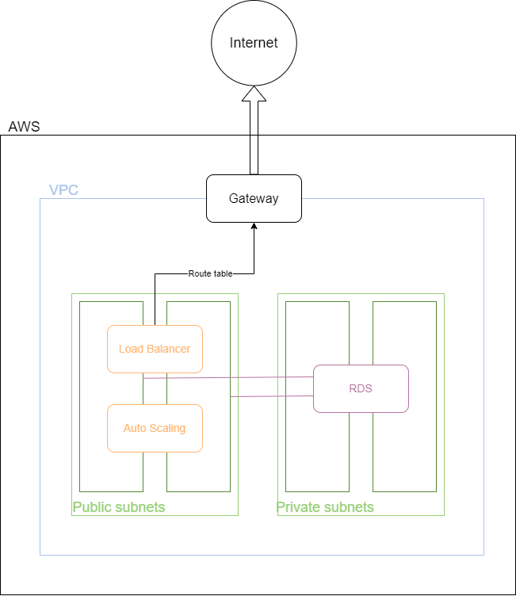

# ProjetoCloud
### Eric Possato

## Objetivo do projeto
Provisionar uma arquitetura na AWS a partir do Terraform que possua:
- Load Balancer
- 2 instâncias EC2 (com Auto Scaling)
- Banco de dados RDS

## Diagrama

## Procedimento para execução do Terraform

- Instalar o Terraform
- Configurar a AWS CLI com as credenciais de access_key_id e secret_access_key da sua conta AWS de acordo com a [documentação oficial](https://docs.aws.amazon.com/cli/latest/userguide/cli-configure-envvars.html)
- Necessário ter um bucket S3 com o nome "eric-terraform-state-e" para guardar o backend do Terraform.
- Alterar terraform.tfvars em *./terraform* com as informações correspondentes ao banco de dados RDS que será criado:
```python
db_username = "<usuário>"
db_password = "<senha>"
```
- Executar os comandos:
```bash
terraform init
terraform validate
terraform plan -out="tfplan"
terraform apply "tfplan"
```

E para destruir a infraestrutura:
```bash
terraform destroy
```

A aplicação estará disponível no DNS do load balancer e pode ser acessada por
```
{DNS Load Balancer}/docs
```

## Decisões do projeto

## Escolha de região

A [escolha de regiões](https://www.concurrencylabs.com/blog/choose-your-aws-region-wisely) foi feita analisando princpalmente, a velocidade de transferência de dados, assim como a latência e o custo de implementação. Considerando o uso/implementação, é importante que seja possível utilizar os serviços de uma região que possua baixa latência de modo a otimizar a velocidade da aplicação, dito isso, também deve ser pesar o custo da mesma. Visto que a região US-East-1 (N. Virginia) possui uma latência razoável quando comparada a SA-East-1 (São Paulo), mas é notávelmente menos custosa, ela foi designada como a região de escolha para a criação da arquitetura. Apesar da região da North Virginia possuir outages frequentes, ainda foi designada como efetiva, já que possui maior quantidade de serviços disponíveis.

## Análise de custo
O custo mensal assim como anual foi calculado a partir da [AWS Pricing Calculator](https://calculator.aws/#/) e os resultados assim como as configurações selecionadas estão disponíves no arquivo *My Estimate - AWS Pricing Calculator.pdf*, também neste repositório.

